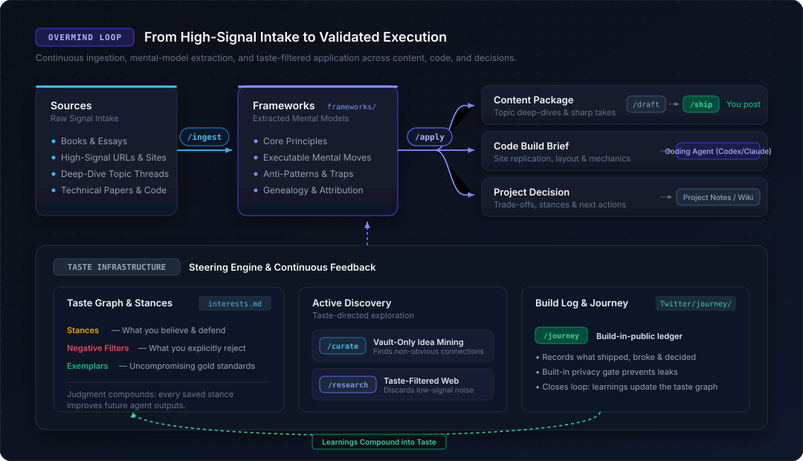
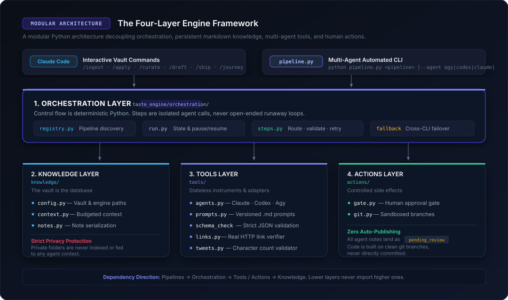
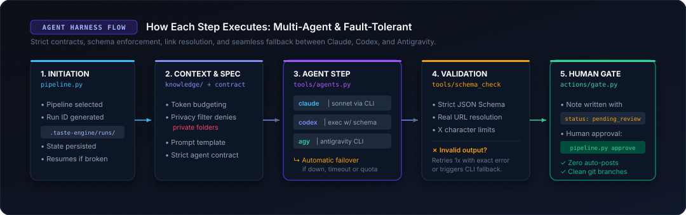

# OverMind

**Turn what you read into how you work.**

**In plain words:** You give it a book, a website, a research paper, or a thread. It extracts *how that author thinks* and stores it as a reusable, executable framework. Later, you ask it to apply that framework to write high-signal content, produce a site-replication build brief for your coding agent ("build it like that site, but mine"), or think through a complex architectural decision. It lives inside your notes app, never posts anything automatically, and keeps your data strictly on your local machine.

An open-source agent harness and taste engine for your second brain (Obsidian or any markdown vault).

You can drive OverMind two ways:
- **Claude Code commands** (`/ingest`, `/apply`, `/draft`, …): interactive, conversationally inside your vault.
- **A multi-agent Python pipeline** (`python pipeline.py ingest …`): deterministic steps routed across different AI CLIs (**Claude Code**, **Codex**, **Antigravity**, **Gemini**) with automatic fallback, strict schema enforcement, and retry logic.

There is no database, server, or SaaS. It is your markdown notes, versioned prompts, and a modular four-layer architecture (**Orchestration · Knowledge · Tools · Actions**) that you can inspect, customize, and extend.

> *Content is infinite now. Taste — what you select, how you combine it, and what you reject — is what's scarce. OverMind codifies your taste so autonomous agents can think with it.*

---

## The Loop



OverMind operates as a continuous learning loop:

1. **Ingest (`/ingest`):** Deconstructs books, essays, repositories, and threads into reusable framework notes: core principles, executable mental moves, anti-patterns, and source genealogy.
2. **Steer (Taste Graph):** Your explicit stances, negative filters, and exemplars (`interests.md`) steer every operation — mining internal vault ideas (`/curate`) and filtering web noise (`/research`).
3. **Apply (`/apply`):** Translates frameworks into concrete execution:
   - **Content Packages:** Outlines and takeaways shaped for social threads.
   - **Code Build Briefs:** Structural deconstructions (layout, typography, motion, mechanics) ready for coding agents.
   - **Project Decisions:** Trade-off analysis aligned with your principles.
4. **Draft & Ship (`/draft` → `/ship`):** Generates threads validated against character limits. **You review and post manually.** OverMind never auto-posts.
5. **Feedback (`/journey`):** Logs what you shipped, broke, and decided in public, compounding your learnings back into your taste graph.

---

## Commands

Run these directly inside your vault with Claude Code:

| Command | What it does |
|---|---|
| `/ingest <source>` | Book / URL / notes → framework note: principles, **executable mental moves**, anti-patterns, genealogy |
| `/apply <framework> content\|code\|project [target]` | Framework → curation package, **site-replication build brief**, or proposed decision |
| `/curate [topic]` | Mines your vault for non-obvious, on-interest ideas and lists what was rejected |
| `/research <topic>` | Web research → taste filter → signal notes + curation package, with rejected sources listed |
| `/draft <note>` | Curation package or journey entry → thread draft, checked against X character limits |
| `/ship <draft> [posted <url>]` | Stages copy-paste text, then logs it after you post. **Never posts for you.** |
| `/journey [what happened]` | Build-in-public entry with tweet candidates and automatic privacy filtering |

### Example: Steal like an artist, for websites

```bash
/ingest Steal Like an Artist by Austin Kleon
/apply steal-like-an-artist code https://some-awwwards-site.com https://a-portfolio-you-love.dev
```

→ Generates `frameworks/briefs/<date>-<slug>-build-brief.md`: an element-by-element breakdown (layout, typography, motion, interaction), what to steal (the mechanism) vs. transform (the expression), acceptance criteria, and source credits. Hand it directly to your coding agent.

---

## Architecture

OverMind decouples control flow from LLM intelligence using a modular four-layer architecture. Every pipeline, agent adapter, and tool lives in a well-defined layer:



| Layer | Folder | Responsibility | Design Rule |
|---|---|---|---|
| **Orchestration** | `orchestration/` | Pipeline registry (`registry.py`), run state manager (`run.py`), step runner (`steps.py`), CLI | Control flow is deterministic Python. LLM calls are isolated steps, never unbounded loops. |
| **Knowledge** | `knowledge/` | Config (`config.py`), context builder (`context.py`), note serialization (`notes.py`) | Markdown is the source of truth. Private folders are never read or indexed. |
| **Tools** | `tools/` | Agent adapters (`agents.py`), versioned prompts, strict schema checkers, URL & tweet validators | Stateless instruments with zero control flow. Fully swappable. |
| **Actions** | `actions/` | Human gatekeeper (`gate.py`), git branching (`git.py`) | Any outward or destructive action requires `status: approved`. Reversible branches over direct commits. |

*Detailed architecture, layer dependencies, and the 12-factor agent mapping are in [ARCHITECTURE.md](ARCHITECTURE.md).*

---

## Multi-Agent Pipeline (CLI)

For headless execution, scheduled tasks, or leveraging multiple AI models across a single task:



```bash
cd <vault>
python <engine>/scripts/pipeline.py list                     # pipelines, agents, routing
python <engine>/scripts/pipeline.py doctor                   # verify installed agent CLIs
python <engine>/scripts/pipeline.py ingest "Make it stick.md"   # vault note, URL, or book title
python <engine>/scripts/pipeline.py curate "agent memory"
python <engine>/scripts/pipeline.py research "temporal knowledge graphs" --agent agy
python <engine>/scripts/pipeline.py draft "<curation note>"
python <engine>/scripts/pipeline.py journey "what I shipped today"
python <engine>/scripts/pipeline.py replicate steal-like-an-artist https://a.com https://b.com --goal "portfolio hero" --build ../my-site
python <engine>/scripts/pipeline.py approve "<file>"          # human gate
python <engine>/scripts/pipeline.py status | resume <run-id>
```

### Pipeline Guarantees
- **Python owns the flow:** Agent CLIs are isolated workers receiving structured prompts and returning strict JSON schemas.
- **Code-level validation:** Schemas, character limits, and web citations are verified programmatically. If invalid, the harness retries once with exact error diagnostics.
- **Cross-model failover:** If your primary agent is rate-limited, down, or unauthorized, the harness automatically falls back to your configured secondary agents (e.g., Claude → Antigravity → Codex).
- **Human-in-the-loop gate:** All generated notes land as `status: pending_review`. Nothing is published, committed, or posted automatically.
- **Resumable runs:** Run state is persisted to `.taste-engine/runs/`. Interrupted runs resume from the last successful step without redundant API costs.

Agent CLIs (install whichever you have available): [Claude Code](https://claude.com/claude-code), [Codex CLI](https://github.com/openai/codex), Antigravity CLI (`agy`), Gemini CLI. Configure routing in `taste-engine.config.json`.

---

## Installation (5 Minutes)

**Prerequisites:** [Claude Code](https://claude.com/claude-code) and Python 3.10+.

```bash
git clone https://github.com/KaiwalPanchal/OverMind.git overmind && cd overmind
python install.py --vault "/path/to/your/vault" --owner "Your Name"
```

### Setup Steps:
1. Edit `<vault>/taste-engine/interests.md` with 3–7 topics you want to explore and be known for.
2. Seed initial stances and negative filters (`python new_curation.py stance "..."`), or allow `/ingest` and `/research` to propose them.
3. Open your vault in Claude Code and run `/ingest` on any book, paper, or article.

Re-running `install.py` updates commands, scripts, prompts, schemas, and templates. It **never modifies your existing notes** or configuration settings.

### Installation Options
| Flag | Default | Description |
|---|---|---|
| `--engine-dir` | `taste-engine` | Folder name for the taste graph, pipeline, and scripts |
| `--frameworks-dir` | `frameworks` | Vault-wide frameworks folder (shared across all projects) |
| `--twitter-dir` | `Twitter` | Build-in-public journey & tweet drafts folder |
| `--overmind-dir` | none | Optional: personal wiki / goals folder (`/ship` and `/journey` log here) |
| `--x-char-limit` | `280` | Character limit for social posts (e.g. increase for X Premium) |

---

## Vault Structure

After installation, your vault will look like:

```
<vault>/
├── CLAUDE.md                       # Marked instructions configuring Claude Code
├── taste-engine.config.json        # Path mappings and agent model routing
├── .claude/commands/*.md           # The 7 vault slash commands
├── .taste-engine/runs/             # Resumable pipeline run logs
├── frameworks/                     # Extracted thinking frameworks & build briefs
│   ├── briefs/
│   └── sources/
├── Twitter/                        # Build-in-public logs & drafts
│   ├── journey/
│   ├── drafts/
│   ├── ready/
│   └── posted.md
└── taste-engine/                   # The taste engine core
    ├── interests.md                # Topics you care about
    ├── 01-taste-graph/             # Stances · Negative-filters · Exemplars
    ├── 02-signals/                 # Papers · Repos · Postmortems · Web notes
    ├── 03-pipeline/                # Inbox → Curation → Drafts → Ready → Archive
    ├── playbooks/                  # Editorial lenses, thread templates, hooks
    ├── templates/                  # Framework & build-brief templates
    └── scripts/                    # pipeline.py, new_curation.py, thread_validator.py
```

---

## Core Principles

- **The machine drafts, you decide:** OverMind does not auto-post. Taste and judgment cannot be outsourced.
- **Frameworks must be executable:** Summaries are passive. Frameworks require concrete mental moves and application rules.
- **Steal from many, credit all:** Every build brief and post traces its genealogy and credits original creators.
- **Ship over structure:** Organizing your second brain is not output. Concrete drafts, briefs, and shipped work are.

See [`examples/`](examples/) for an end-to-end framework example (*Steal Like an Artist* by Austin Kleon).

---

## Contributing

Contributions, bug reports, and pull requests are welcome — especially new command modes for `/apply`, community playbooks, and framework templates.

If contributing from your own vault, enable the pre-commit privacy hook to safeguard private notes:

```bash
git config core.hooksPath .githooks
echo "your-private-project-name" >> .private-strings   # Local gitignored deny-list
```

---

## License

[MIT](LICENSE) © 2026 OverMind Contributors
