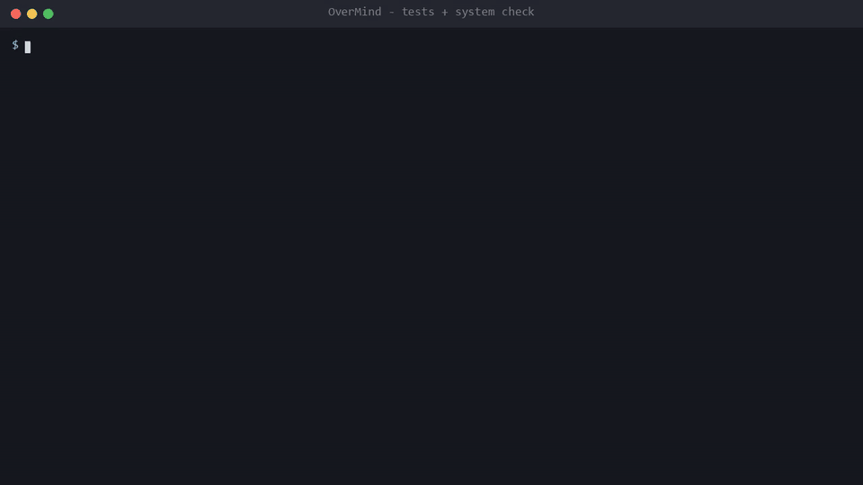
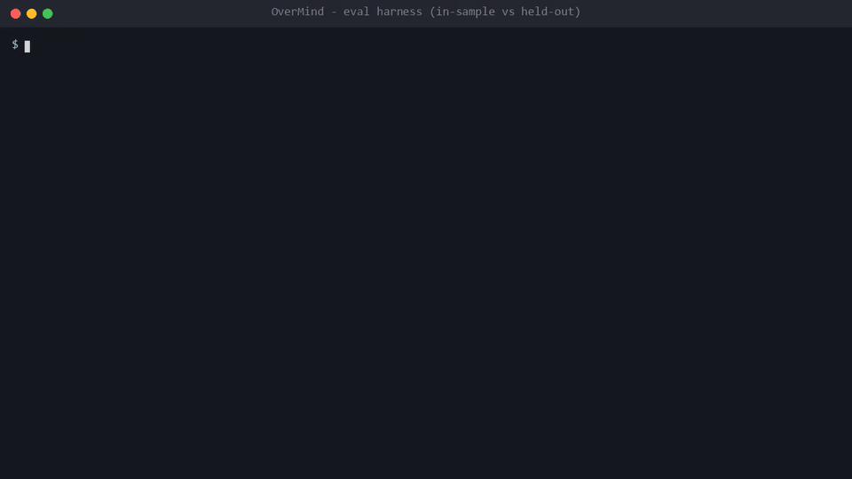
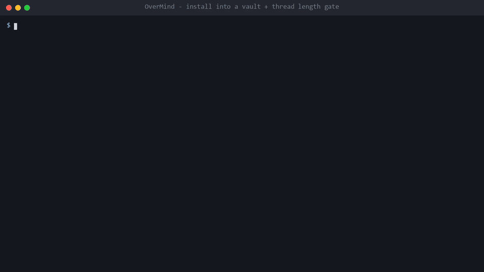

# Noetic

[](https://github.com/KaiwalPanchal/Noetic/actions)
[](https://www.python.org/downloads/)
[](https://modelcontextprotocol.io)
[-orange.svg)](docs/threat-model.md)
[](LICENSE)

**Turn what you read into how you work.**

**In plain words:** You give it a book, a website, or a research paper. It extracts *how that author thinks* and stores it as a reusable, executable framework. Later, you ask it to apply that framework to produce a site-replication build brief for your coding agent ("build it like that site, but mine"), or think through a complex architectural decision. It lives inside your notes app, never posts anything automatically, and keeps your data strictly on your local machine.

An open-source agent harness and taste engine for your second brain (Obsidian or any markdown vault).


> **Names, to avoid confusion.** The repo and project are **Noetic** (https://github.com/KaiwalPanchal/Noetic; locally the folder may be called `noetic`). The installable Python package is **`noetic-cli`** (it provides the `noetic` and `noetic-mcp` commands). The importable modules are **`noetic`** (the core) and **`workflows`** (self-contained products such as `taste_engine` and `twitter`). "Taste Engine" is the name of the vault-side system the package installs.

## Quickstart

Install into any markdown vault in one command (needs [uv](https://docs.astral.sh/uv/) or pipx):

```bash
# macOS / Linux
curl -sSL https://raw.githubusercontent.com/KaiwalPanchal/Noetic/main/install.sh | bash -s -- --vault ~/my-vault
# Windows PowerShell
irm https://raw.githubusercontent.com/KaiwalPanchal/Noetic/main/install.ps1 | iex
# or directly, no global install
uvx --from noetic-cli noetic install --vault /path/to/vault
uvx --from noetic-cli noetic mcp-config --vault /path/to/vault   # wire up Claude Desktop / Claude Code / Cursor / Windsurf
```

Or work from a checkout:

```bash
git clone https://github.com/KaiwalPanchal/Noetic.git && cd Noetic
pip install -e ".[test]"
pytest -q          # run the test suite
noetic doctor    # check agent CLIs, MCP server construction, policy gate
noetic eval      # run the eval harness (see "Eval Harness" below for what it does and does not measure)
```

Output captured from a real run (Windows, Python 3.14; the agent table in `doctor` depends on which CLIs you have installed):

```text
$ pytest -q
166 passed in 3.0s

$ noetic doctor        # excerpt
[OK] Model Context Protocol (MCP) Server: Ready (Noetic v0.2.0)
[OK] Security Policy Gate: Active (AST validation operational)

$ noetic eval
Extractor: rule-based-baseline
Dataset: golden_dataset.json  (30 cases)
TP: 23 | FP: 0 | TN: 7 | FN: 0
F1 Score                  | 1.000
GATE PASSED: F1 1.000 >= 0.8

$ noetic eval --dataset heldout
Dataset: heldout_dataset.json  (12 cases)
TP: 6 | FP: 4 | TN: 2 | FN: 0
F1 Score                  | 0.750
GATE FAILED: F1 0.750 < 0.8
```

The second result is expected and is the point: the baseline's rules were written while looking at the 30-case golden set (in-sample), and it drops to F1 0.750 on 12 cases written afterwards.

## Demos

Terminal recordings of the real CLI (each command is executed and its captured output replayed; regenerate with `python demo/record.py`, scenes in [`demo/scenes.json`](demo/scenes.json)). MP4 versions sit next to the GIFs.

**Tests and system check**: `pytest`, `noetic doctor` ([mp4](demo/01-tests-and-doctor.mp4))



**Eval harness**: in-sample vs held-out. The baseline passes the 30 cases it was tuned on and fails the gate on 12 unseen ones, on purpose ([mp4](demo/02-eval-harness.mp4))



**Install into a vault + thread length gate**: `install.py`, then `noetic validate-thread` rejecting an over-limit tweet ([mp4](demo/03-install-and-thread-gate.mp4))



---

## Philosophy: You Are the Filter

> *"Thinking in frameworks is the most underrated skill of the AI age."*

### 1. AI Moved the Bottleneck to Taste
Learning from a book used to mean reading it twice, highlighting passages, and hoping some insight showed up when you needed it. Mostly it didn't.

Now, an agent can read any source, extract arguments, and summarize in seconds. Consuming, summarizing, and understanding content is basically solved.

**What's left is Taste:** knowing what to keep, what to reject, and what you are actually trying to build. That part is yours, and it is the only part that matters. What you reject (your negative filters) defines you more than what you hoard.

### 2. Evolutionary Loops: You Are the Selection Pressure
The more iterations a system runs, the faster it compounds toward excellence:
- **Nature:** variation → selection → repeat.
- **Machine Learning:** guess → measure loss → adjust → repeat.
- **Craft & Engineering:** draft → critique → revise → repeat.

Noetic optimizes for **cycle time and fast iteration loops**, not first-try perfection:
- **The machine generates the variations.** It drafts frameworks, outlines briefs, and proposes code replications.
- **You are the selection pressure.** Your taste, stances, and real-world judgment decide what survives into the next round.
- **Taste cannot be outsourced.** The machine drafts, you decide.

### 3. The Core Stances
- **Frameworks over summaries:** A summary sits passively on disk. A framework is executable — if you cannot apply it to a codebase, design, or decision, you didn't learn it.
- **Taste is subtraction:** What you reject defines your work. Negative filters protect your attention from noise and web sludge.
- **The machine drafts, you decide:** Noetic enforces zero automatic publishing. Human approval gates are mandatory before anything is permanent.
- **Iteration count beats first-draft quality:** Reps with rapid feedback beat endless planning.
- **Ship over structure:** Organizing your second brain is not output. Shipped code, published ideas, and completed briefs are.
- **Steal from many, credit all:** Every build brief traces its lineage and credits original creators.

Read the full philosophical grounding in [`PHILOSOPHY.md`](PHILOSOPHY.md) and the essay [*You Are the Filter*](essays/overmind-essay-my-voice-v2.md).

---

### Architecture: The 4 Primitives

Noetic unifies your work into **four core primitives**:
- **Projects:** Active goals, build briefs, ideas incubator, roadmaps, and domain applications (e.g. the Twitter pack in `workflows/twitter/`, `ideas/`, site replication).
- **Knowledge Base:** Ground truth on disk — your local markdown vault, taste graph, stances, negative filters, and extracted thinking frameworks.
- **Tools:** Pure, stateless instruments — model adapters, scrapers, schema checkers, link verifiers, and the Web Clipper (`tools/clipper.py`).
- **Agents:** Autonomous intelligences and pipeline orchestrators (`compete`, `curate`, `research`, `ingest`, `goal-aligner`) bound by strict human-approval gates.

> **The Inception Loop:** Noetic is a self-bootstrapping meta-harness — **we use Noetic to design, test, and build Noetic itself.** Specific workflows (like Twitter build-in-public or competitor research) are not baked into the core engine; they are modular **projects** or **pipelines** running on top of it.
>
> **The Agent's Role:** Autonomous agents wire these primitives together. Noetic can also be exposed as an **MCP (Model Context Protocol)** server to any coding agent (Claude Code, Cursor, Antigravity, Codex).

```
┌──────────────────────────────────────────────────────────────────────────────┐
│                            CODING AGENTS (CLIENTS)                           │
│        Claude Code   ·   Cursor   ·   Antigravity   ·   Codex   ·   CLI      │
└──────────────────────────────────────┬───────────────────────────────────────┘
                                       │
                               MCP Protocol / CLI
                                       │
┌──────────────────────────────────────▼───────────────────────────────────────┐
│                              AGENT ORCHESTRATOR                              │
│         Wires blocks together · Manages flow · Enforces schemas & gates       │
└───────────┬────────────────────┬────────────────────┬────────────────────┬───┘
            │                    │                    │                    │
┌───────────▼────────┐   ┌───────▼────────┐   ┌───────▼────────┐   ┌───────▼────────┐
│     PROJECTS       │   │ KNOWLEDGE BASE │   │     TOOLS      │   │     AGENTS     │
├────────────────────┤   ├────────────────┤   ├────────────────┤   ├────────────────┤
│ · Noetic Engine  │   │ · Vault Notes  │   │ · Model Adapts │   │ · Subagents    │
│ · Twitter Pack     │   │ · Taste Graph  │   │ · Schema Check │   │ · Goal Aligner │
│ · Ideas Incubator  │   │ · Stances      │   │ · Web Clipper  │   │ · Multi-model  │
│ · Build Briefs     │   │ · Frameworks   │   │ · Link Verifier│   │ · Human Gates  │
└────────────────────┘   └────────────────┘   └────────────────┘   └────────────────┘
            ▲                    ▲                    ▲                    ▲
            └────────────────────┴──────────┬─────────┴────────────────────┘
                                            │
                             COMPOSABLE BUILDING BLOCKS
                    (Plug and play in whatever order you want)
```

### The 4 Primitives
1. **Projects:** Where intent lives. Contains active goals, site-replication briefs, the ideas incubator (`ideas/`), and modular project packs (e.g. `workflows/twitter/`).
2. **Knowledge Base:** Ground truth on disk. Your markdown second brain, taste graph (`interests.md`), stances (what you defend), negative filters (what you reject), and deconstructed thinking frameworks.
3. **Tools:** Pure, stateless instruments. Model adapters (`claude`, `codex`, `agy`), prompt templates, strict JSON schema validators, link checkers, and the stateless Web Clipper (`tools/clipper.py`).
4. **Agents:** Autonomous intelligences & pipelines. Multi-step pipelines (`compete`, `curate`, `research`, `ingest`, `replicate`) and specialized agents (e.g. `goal-aligner`) operating under human-in-the-loop review gates (`status: pending_review`).

---

## The Loop

```
 [ SOURCES ] ───▶ [ /ingest ] ───▶ [ FRAMEWORKS ]
 (Books, URLs,                     (Mental moves &
  Papers, Code)                     principles)
                                         │
                                         ▼
                                   [ /apply ]
                                         │
                 ┌───────────────────────┼───────────────────────┐
                 │                       │                       │
                 ▼                       ▼                       ▼
          [ CODE BRIEFS ]       [ PROJECT DECISIONS ]     [ CONTENT / POSTS ]
        (Site Replication)       (Noetic Meta-Build)     (Your Project)  
                 │                       │                       │
                 ▼                       ▼                       ▼
          [ Coding Agent ]        [ Project Wiki ]        [ Review Stager ]
                 │                       │                       │
                 ▼                       ▼                       ▼
           Git Branch              Permanent Note          Human Approval
          (Sandboxed)              (Ground Truth)          (Zero Auto-Post)

 ─────────────────────────────────────────────────────────────────────────────
  STEERING FOUNDATION (Taste Graph): interests.md · Stances · Negative Filters
  FEEDBACK LOOP: real execution results ──▶ compound back into Taste
```

Noetic operates as a continuous learning loop across the blocks:
1. **Ingest (`/ingest`):** Pulls from **Sources** into the **Knowledge Base**, extracting mental moves and core principles.
2. **Steer (Taste Graph):** The **Knowledge Base** guides what is worth keeping, what gets mined (`/curate`), and what web noise gets rejected (`/research`).
3. **Apply (`/apply`):** Translates frameworks into target **Projects** (content packages, code build briefs, or decisions).
4. **Execute & Gate:** The **Agent Orchestrator** triggers **Tools** and **Actions** (coding agents build on git branches; content is drafted for manual review).
5. **Feedback:** Real-world build results feed back into the **Knowledge Base**, updating your stances and taste.

---

## Commands

Run these directly inside your vault with Claude Code:

| Command | What it does | Primitives Used |
|---|---|---|
| `/ingest <source>` | Book / URL / notes → framework note: principles, **mental moves**, anti-patterns | Knowledge |
| `/apply <framework> content\|code\|project [target]` | Framework → curation package, **build brief**, or proposed decision | Knowledge → Projects |
| `/curate [topic]` | Mines vault for non-obvious ideas and records what was rejected | Knowledge |
| `/research <topic>` | Taste-filtered web research → signal notes + curation package | Tools → Knowledge |

### Example: Steal like an artist, for websites

```bash
/ingest Steal Like an Artist by Austin Kleon
/apply steal-like-an-artist code https://some-awwwards-site.com https://a-portfolio-you-love.dev
```

→ Generates `frameworks/briefs/<date>-<slug>-build-brief.md`: an element-by-element breakdown (layout, typography, motion, interaction), what to steal (the mechanism) vs. transform (the expression), acceptance criteria, and source credits. Hand it directly to your coding agent.

---

## Multi-Agent Pipeline & CLI

For automated runs, scheduled tasks, or using multiple AI models with failover:

```
 [ noetic run <command> ]
            │
            ▼
 ┌──────────────────────┐
 │ Context Assembly     │ ──▶ Budgeted tokens & strict privacy deny-list
 └──────────┬───────────┘
            │
            ▼
 ┌──────────────────────┐
 │ Agent Dispatch       │ ──▶ Primary: Claude Code (Sonnet)
 └──────────┬───────────┘          │ (down / timeout / quota)
            │                      ▼
            │                 Fallback: Antigravity / Codex
            │
            ▼
 ┌──────────────────────┐
 │ Strict Validation    │ ──▶ Schema Check + Link Verifier + Char Counter
 └──────────┬───────────┘
            ├─── ✗ Invalid  ──▶ Retry 1x with exact error diagnostic
            └─── ✓ Valid
                    │
                    ▼
         ┌──────────────────────┐
         │ status: pending      │ ──▶ Written to Markdown vault
         └──────────┬───────────┘
                    │
                    ▼
         ┌──────────────────────┐
         │ Human Approval Gate  │ ──▶ noetic approve <file>
         └──────────────────────┘
```

```bash
cd <vault>
noetic run list                     # pipelines, agents, routing
noetic run doctor                   # verify installed agent CLIs
noetic run ingest "Make it stick.md"   # vault note, URL, or book title
noetic run curate "agent memory"
noetic run research "temporal knowledge graphs" --agent agy
noetic run replicate steal-like-an-artist https://a.com https://b.com --goal "portfolio hero" --build ../my-site
noetic run approve "<file>"          # human gate
noetic run status | resume <run-id>
```

### Pipeline Guarantees
- **Python owns the flow:** Agent CLIs are isolated workers receiving structured prompts and returning strict JSON schemas.
- **Code-level validation:** Schemas and web citations are verified programmatically. If invalid, the harness retries once with exact error diagnostics.
- **Cross-model failover:** If your primary agent is rate-limited, down, or unauthorized, the harness automatically falls back to your configured secondary agents (e.g., Claude → Antigravity → Codex).
- **Human-in-the-loop gate:** All generated notes land as `status: pending_review`. Nothing is published, committed, or posted automatically.
- **Resumable runs:** Run state is persisted to `.taste-engine/runs/`. Interrupted runs resume from the last successful step without redundant API costs.

Agent CLIs supported: [Claude Code](https://claude.com/claude-code), [Codex CLI](https://github.com/openai/codex), Antigravity CLI (`agy`), Gemini CLI. Configure routing in `taste-engine.config.json`.

---

## Model Context Protocol (MCP) Server

Noetic exposes its resources and tools through an MCP server built on the official [`mcp` Python SDK](https://pypi.org/project/mcp/) (2.x, `mcp.server.mcpserver.MCPServer`; the import was checked against the installed SDK). Transports `stdio`, `sse` and `streamable-http` are passed through to the SDK. The repo's tests call the registered tools and construct the server; they do not run a client-side protocol conformance suite, so "compliant" is not claimed.

### 1. Client configuration (one command)
```bash
noetic mcp-config --vault /path/to/vault                     # all clients
noetic mcp-config --vault /path/to/vault --client cursor     # claude-desktop | claude-code | cursor | windsurf
noetic mcp-config --vault /path/to/vault --dry-run           # preview
```
This merges an `noetic` entry into each client's config (`%APPDATA%\Claude\claude_desktop_config.json`, `<vault>/.mcp.json`, `<vault>/.cursor/mcp.json` or `~/.cursor/mcp.json` with `--scope global`, `~/.codeium/windsurf/mcp_config.json`). Other servers and keys are kept; a malformed file is left untouched. By hand, the entry is:

```json
{ "mcpServers": { "noetic": { "command": "noetic-mcp", "args": ["--vault", "C:/path/to/your/vault"] } } }
```

### 2. Capabilities Exposed via MCP:
- **Resources:**
  - `noetic://stances`: Real-time personal taste stances and negative filters from `interests.md`.
  - `noetic://frameworks`: Catalog of extracted mental models and architectural frameworks.
  - `noetic://status`: Active projects, run logs, and pipeline health.
- **Tools:**
  - `validate_thread`: Validates Twitter/X thread drafts with official weighting rules.
  - `inspect_code_safety`: Pre-execution AST static analysis blocking unsafe system calls.
  - `check_json_schema`: Validates agent responses against strict JSON schemas.

---

## 1-Click Installation & Modern CLI

Noetic is packaged as a standard Python tool:

```bash
# Install the released package (once published to PyPI)
pipx install noetic-cli      # or: uvx --from noetic-cli noetic --help

# Development mode
git clone https://github.com/KaiwalPanchal/Noetic.git && cd Noetic
pip install -e .[test]

# System Diagnostic & Health Check
noetic doctor

# Install into a vault / wire MCP clients
noetic install --vault /path/to/vault --agents claude,gemini --with-wiki
noetic mcp-config --vault /path/to/vault

# Run MCP Server
noetic mcp --transport stdio

# Run the eval harness (rule-based baseline extractor by default)
noetic eval
```

---

## Eval Harness (grader + pluggable extractor)

**What it is.** A labelled-dataset grading harness in `noetic/evals/`: deterministic graders (schema, required-entity recall, forbidden-buzzword penalty, injection-marker leak) feed an approve/reject decision, scored with accuracy / precision / recall / F1 / Cohen's kappa. It grades *any* extractor `(source_text) -> dict` (see `evals/extractors.py`), which receives only the source text, never the label or category.

**What it is not.** It does not evaluate the LLM extraction pipeline. No LLM is called. An earlier version graded a hard-coded stub and reported F1 = 1.0; that was circular and has been removed.

**What ships.**
- `RuleBasedExtractor`: a deterministic, zero-cost extractive baseline. Its rules were written after reading the 30-case `golden_dataset.json`, so its score there (F1 1.000) is in-sample.
- `heldout_dataset.json`: 12 cases written after the rules were frozen. Measured result: TP 6, FP 4, TN 2, FN 0, F1 0.750, kappa 0.333. The baseline over-accepts subtle injections and marketing copy it has no rule for.
- Harness tests (`tests/test_eval_harness.py`) use synthetic extractors with known outcomes (oracle, always-reject, echo-everything) to check the grading and metric plumbing.
- The datasets are small. Treat the numbers as a smoke signal and a regression floor, not a benchmark.

**Plug in a real extractor.**

```bash
noetic eval --extractor my_pkg.my_module:my_extractor --dataset heldout --output results.json
```

`my_extractor` is any callable (or zero-arg class) returning `{"title", "core_principles", "mental_moves", "anti_patterns", "rejected"}`. No real-LLM result is reported here because none has been run.

CI runs the baseline on both datasets: golden with the default 0.80 F1 floor, held-out with a 0.5 floor (`.github/workflows/ci.yml`).

---

## Security & Architectural Threat Model

- **Static policy gate (`noetic/gates/policy_gate.py`).** A best-effort denylist, **not a sandbox**. `validate_python_ast` blocks dangerous builtins (`eval`, `exec`, `compile`, `__import__`, `getattr`, `open`, ...), forbidden imports (`subprocess`, `importlib`, `ctypes`, `builtins`, `socket`, `pty`), `os.system`/`os.popen`/`shutil.rmtree` including through import aliases, and dunder-based escape chains (`__class__`, `__subclasses__`, `__globals__`, ...). Python can still be obfuscated past a denylist, and the project runs no process sandbox. Do not execute untrusted code on the strength of this check.
- **Path confinement.** `validate_vault_path` rejects any `..` segment, anything resolving outside the vault, and protected names (`.env`, `.git`, `.private-strings`, keys).
- **Input sanitizing.** `sanitize_input` enforces a length budget, strips NULs and rejects reserved `taste-engine` block markers. It is a library function: the pipelines do not call it yet.
- **Human approval gate.** Generated notes land as `status: pending_review`; nothing is published or committed automatically.
- Details, test counts and residual risk are in [`docs/threat-model.md`](docs/threat-model.md).

### Installation Options
| Flag | Default | Description |
|---|---|---|
| `--engine-dir` | `taste-engine` | Folder name for the taste graph, pipeline, and scripts |
| `--frameworks-dir` | `frameworks` | Vault-wide frameworks folder (shared across all projects) |
| `--overmind-dir` | none | Optional: personal wiki / goals folder |

---

## Vault Structure

```
<vault>/
├── CLAUDE.md                       # Marked instructions configuring Claude Code
├── taste-engine.config.json        # Path mappings and agent model routing
├── .env.example                    # Template for module secrets (e.g. MONGODB_URI)
├── .claude/commands/*.md           # The vault slash commands
├── .taste-engine/runs/             # Resumable pipeline run logs
├── frameworks/                     # Extracted thinking frameworks & build briefs
│   ├── briefs/
│   └── sources/
└── taste-engine/                   # The taste engine core
    ├── interests.md                # Topics you care about
    ├── 01-taste-graph/             # Stances · Negative-filters · Exemplars
    ├── 02-signals/                 # Papers · Repos · Postmortems · Web notes
    ├── 03-pipeline/                # Inbox → Curation → Drafts → Ready → Archive
    ├── playbooks/                  # Editorial lenses and reusable playbooks
    └── scripts/                    # noetic/ and workflows/ packages (importable)
```

---

## Further Reading & Examples

- **How to Use It:** [`docs/HOW_TO_USE.md`](docs/HOW_TO_USE.md) is the step-by-step guide: install, connect your AI tools, daily commands, troubleshooting.
- **The Philosophy in Full:** [`PHILOSOPHY.md`](PHILOSOPHY.md) covers why thinking in frameworks is the defining skill of the AI age, and why AI moved the bottleneck to taste.
- **The Long Essay:** [*You Are the Filter*](essays/overmind-essay-my-voice-v2.md) dives deep into evolutionary loops and selection pressure.
- **End-to-End Walkthrough:** See [`examples/`](examples/) for a complete framework extraction and application from Austin Kleon's *Steal Like an Artist*.

---

## Contributing

Contributions, bug reports, and pull requests are welcome.

If contributing from your own vault, enable the pre-commit privacy hook:

```bash
git config core.hooksPath .githooks
echo "your-private-project-name" >> .private-strings   # Local gitignored deny-list
```

---

## License

[MIT](LICENSE) © 2026 Noetic Contributors
